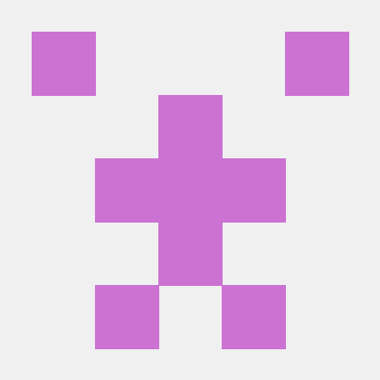
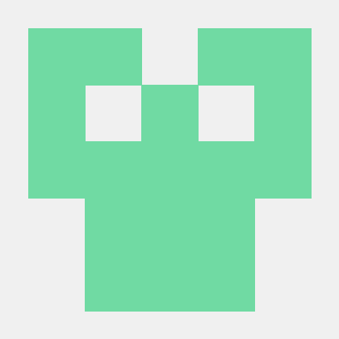

<h1 align="center">Leibniz</h1>

<p align="center">
  
</p>

<p align="center">
A math-focused programming language built for clarity, precision, and exploration.
</p>

<p align="center">
  🔗 <a href="https://lilscolari.github.io/leibniz/">View the Pages site here</a>
</p>

<p align="center">
  🔗 <a href="https://github.com/lilscolari/leibniz/blob/main/src/leibniz.ohm">View the language Grammar here</a>
</p>

---

## 🧠 About the Project

Leibniz is a math-focused programming language created by **Cameron, Atul, Doug, and Artur**. Inspired by our shared passion for mathematics, we set out to build a language that makes mathematical computation more intuitive, expressive, and accessible.

Our goal is to allow users to seamlessly integrate powerful mathematical tools into their code, improving both readability and functionality.

The language is named after **Gottfried Wilhelm Leibniz**, one of the inventors of calculus and the creator of the **Leibniz calculator**—one of the first machines capable of performing all four basic arithmetic operations. His influence on symbolic logic and mathematics makes him the perfect namesake.

---

## 🚀 Features

Leibniz currently supports:

- ✅ Function creation and calling  
- 🔁 `for` and `while` loops  
- 🧮 Basic arithmetic: negation, addition, subtraction, multiplication, division, exponentiation, and modulus  
- 🔣 Mathematical constants like `pi`  
- 📐 Built-in math functions: `cos`, `sin`, `domain`, etc.  
- ✍️ Variable declaration and assignment  
- 📤 Print statements  
- 🧾 Conditional statements with inequalities (`if-else`)  
- 🧱 Object (shape) declarations  
- 🧬 Symbolic differentiation (`derivative` function)  

With support for user-defined functions and shapes, Leibniz allows users to explore and analyze how different branches of mathematics interact through code.

---

## 🛑 Examples of Static Errors

| ❌ Error Message |
|------------------|
| All elements must have the same type, found string when expected integer |
| Cannot assign string to integer |
| Expected not a keyword |
| Variable already declared: x |
| Cannot assign boolean to integer |
| Expected boolean |
| Expected number |
| Cannot add boolean and integer |
| Expected number or string |
| Expected number, integer, or float, got string |
| `x` not declared |
| Expected number |
| Expected a digit |
| Object `new_triangle` not found |
| Expected `radius`, `circumference`, `perimeter`, `area`, `filter`, or `map` |
| Circle requires **1 argument** (radius), got 2 |
| Rectangle requires **2 arguments** (width, height), got 0 |
| Triangle requires **3 arguments** (sides), got 0 |
| Expected `"Circle"`, `"Rectangle"`, or `"Triangle"` |
| Assignment to immutable variable |
| Error: domain() requires 1 to 3 arguments, got 0 |
| Cannot call filter on non-array type Circle |
| Error: Void function cannot return a value |
| Error: All rows in a matrix must have the same length |
| Error: Matrix elements must be numeric |
| Error: sort functions only works on arrays |
| Type mismatch: integer and boolean |
| All elements must have the same type, found string when expected integer |


---

## 🚀 Features of the Language

| 🧩 Feature         | 💡 Explanation                                                   |
|-------------------|------------------------------------------------------------------|
| Reserved Words     | For easy integration of mathematical terminology                |
| Statically Typed  | To ensure mathematical correctness and detect errors early       |
| Semicolons         | To mark the end of a statement                                  |
| Trig Functions     | To allow more mathematical versatility                          |
| Shapes             | To expand into geometry                                          |
| Error Handling     | Handles math errors (like division by zero)                     |
| Immutability       | Ensures values don't change accidentally                        |
| Pattern Matching   | Especially useful with variables and symbolic computation       |
| Function Creation | So users can model their own math functions or equations         |
| Loops              | So users can perform complex artihmetic like summation or products |
| Math Constants     | Leverage constants to help compute values                       |
| Arithmetic         | The foundation of math                                               |
| Print Statements   | To visualize mathematical output                                |
| Conditionals and Inequalities | A lot of math formulas or concepts depend on this    |
| Derivatives        | So users can experiment with differentiation                    |

---

## 💻 Potential Example Programs

### 🔹 Derivative Example

```leibniz
let f_prime: float = derivative("x^2", "x", 3);
```
<sub><b>Generated Output:</b></sub>  
```js
let f_prime_1 = derivative("x^2", "x", 3);
```

### 🔹 Object and Method Call

```leibniz
obj t = Triangle(3, 5, 6);
print(t.area());
obj c = Circle(5);
print(c.circumference());
```
<sub><b>Generated Output:</b></sub>  
```js
let t_1 = {side1: 3, side2: 5, side3: 6};
console.log(t_1.area());
let c_2 = {radius: 5};
console.log(c_2.circumference());
```

### 🔹 Conditional Statement

```leibniz
if cos(0) == 1 {
  print(true);
} else if cos(0) == 0 {
  print(false);
} else {
  print(cos(0));
}
```
<sub><b>Generated Output:</b></sub>  
```js
if (Math.cos(0) === 1) {
  console.log(true);
} else if (Math.cos(0) === 0) {
  console.log(false);
} else {
  console.log(Math.cos(0));
}
```

### 🔹 Math Functions

```leibniz
print(sin(pi));
print(cos(pi/2));
print(pow(e, 2));
print(max(1, 2));
print(round(3.14159265));
```
<sub><b>Generated Output:</b></sub>  
```js
console.log(Math.sin(3.141592653589793));
console.log(Math.cos(3.141592653589793 / 2));
console.log(pow(2.718281828459045, 2));
console.log(Math.max(1, 2));
console.log(Math.round(3.14159265));
```

### 🔹 For Loop

```leibniz
for i in domain(5) {
  print(i);
}
```
<sub><b>Generated Output:</b></sub>  
```js
for (let i_1 of [0,1,2,3,4]) {
  console.log(i_1);
}
```

### 🔹 While Loop

```leibniz
while (true) {
  print(1);
}
```
<sub><b>Generated Output:</b></sub>  
```js
while (true) {
  console.log(1);
}
```

### 🔹 Functions

```leibniz
fnc f(x: integer): integer = {
  return x;
}
let y: integer = f(1);
```
<sub><b>Generated Output:</b></sub>  
```js
function f_1(x_2) {
  return x_2;
}
let y_3 = f_1(1);
```

### 🔹 Arrays

```leibniz
let a: integer[] = [1, 2, 3];
let x: integer = a[0];
let length: integer = #a;
```
<sub><b>Generated Output:</b></sub>  
```js
let a_1 = [1, 2, 3];
let x_2 = a_1[0];
let length_3 = #(a_1);
```


---

<h2 align="center">👥 Contributors</h2>

<p align="center">
  <a href="https://github.com/lilscolari">
    
  </a>
  <a href="https://github.com/avenky72">
    
  </a>
  <a href="https://github.com/dougspaeth">
    
  </a>
  <a href="https://github.com/hellobro31">
    
  </a>
</p>

<p align="center">
  <i>Logo generated with the help of Dall-E 3.0</i>
</p>

